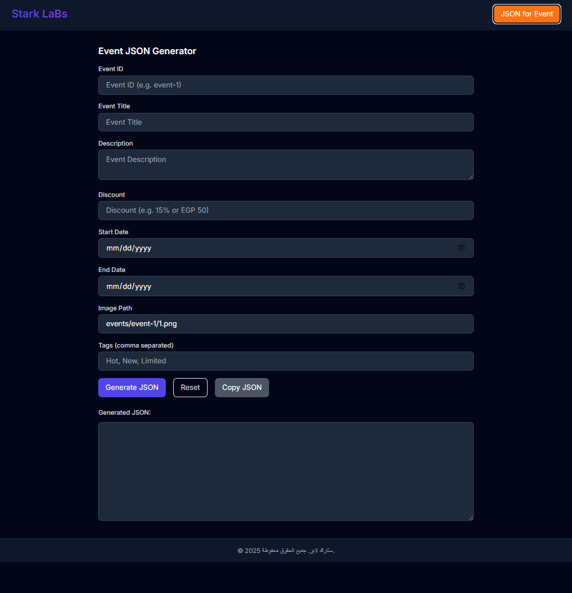

# StarkLabs Project JSON Panel

A modern, responsive admin panel for managing and generating 3D printing project data in JSON format. Built with Tailwind CSS, this tool simplifies the process of creating and managing 3D printing project metadata with an intuitive user interface.

## ✨ Features

- 🎨 **Modern UI/UX** with light/dark theme support
- 📝 **Form-based Interface** for easy data entry
- 🔄 **Real-time JSON Preview** of your project data
- 📁 **Automatic Path Generation** for models and images
- 📱 **Fully Responsive** design that works on all devices
- 🎯 **Input Validation** to ensure data integrity
- 📋 **Copy to Clipboard** functionality for easy data transfer
- 🖨️ **Print Time Calculator** for project planning

## 🚀 Getting Started

### Prerequisites
- A modern web browser (Chrome, Firefox, Safari, or Edge)
- No server or installation required - runs directly in the browser

### Usage
1. Open `index.html` in your preferred web browser
2. Fill in the project details in the form
3. View the generated JSON in real-time
4. Copy the JSON output to use in your StarkLabs application

## 🛠️ Technologies Used

- HTML5
- CSS3 (with Tailwind CSS)
- JavaScript (Vanilla)
- [Tailwind CSS](https://tailwindcss.com/) - A utility-first CSS framework
- [Google Fonts](https://fonts.google.com/) - For the Inter font family

## 📝 Form Fields

- **Folder Name**: Unique identifier for your project
- **Project Title**: Display name of your project
- **Description**: Detailed project description
- **Category**: Project classification
- **Model Files**: Upload or specify paths to 3D model files
- **Image Files**: Upload or specify paths to project images
- **Print Time**: Estimated printing duration
- **Additional Metadata**: Tags, materials, and other relevant information

## 📦 JSON Output

The panel generates a structured JSON object containing all project metadata, ready to be consumed by StarkLabs applications. The output includes:

- Basic project information
- File paths for models and images
- Print settings and specifications
- Categorized metadata
- Creation and modification timestamps

## 🌟 Features in Detail

### Theme Support
- Toggle between light and dark themes
- System preference detection
- Smooth transitions between themes

### Form Validation
- Required field validation
- Input formatting
- Real-time feedback

### Data Management
- Structured data organization
- Easy-to-edit fields
- Clear visual hierarchy

## 🤝 Contributing

Contributions are welcome! Please feel free to submit a Pull Request.

## 📄 License

This project is licensed under the MIT License - see the [LICENSE](LICENSE) file for details.

## 📞 Contact

For inquiries or support, feel free to reach out through:

- **LinkedIn:** [Ahmed M. Attia](https://www.linkedin.com/in/ahmed-mohamed-attia-03320a308/)
- **GitHub:** [Ahm3d0x](https://github.com/Ahm3d0x)

**Developer:** Ahmed Mohamed Attia  
**Location:** Kafr Saqr, Sharqia, Egypt
    